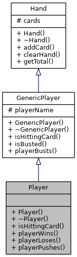

# Game Blackjack. Blackjack is a classic casino card game of luck and strategy.

## 1. REQUIREMENTS

### 1.1 Developer

* Khelemendyk Dmytro;
* 19-july-2022.

### 1.2 General task

Implement the card game Blackjack in the console.

## 2. PROGRAM DESCRIPTION

### 2.1 Functional purpose

The program is designed to play the Blackjack card game. From 1 to 7 players can participate in it. The program works with the help of functions declared in *hand.h*, *player.h*, *game.h* *iostream*, *vector*, *ctime*, *cctype* and *algorithm*.

Demonstration of the found results involves the execution of the program in the console window.

### 2.2 Description of the logical structure

With the help of the *class* keyword, I describe a card that reflects the rank and suit of the card. A class has been developed, the content of which is given below. The card has two enumeration: rank and suit. As well as available methods: constructor, destructor, getting the value of the card, flipping the card and overloading the output operator.


Also I describe a hand that holds cards and has the following methods: constructor, destructor, adding a card to the hand, clearing the hand of cards, getting the sum of cards points in the player's hand.


Next, I create an abstract class "GenericPlayer", which inherits the parameters and methods of the hand class, has its own name and methods: constructor, destructor, whether the player busted (purely virtual function), output operator and printing the player who busted to the screen.


Now I represent a player that inherits from generic player and completes itself by methods: constructor, destructor, whether the player want to take a card, win, lose and push.



Also I create a dealer who is a representative of the casino.The following methods have been added: constructor, destructor, whether the dealer want to take a card, and flipping the first card.


Next, I describe a playing deck of cards, which inherits hand. This object creates and shuffles the deck, deals with the player, and adds an additional card to the player.


Finally, I create a "game" class that will conduct the game. It has a method that will start the gameplay.


Description of the developed structures and functions is based on the results of the auto-documentation system *Doxygen*.

#### Introduction

```
	Action introduction();
```

*Purpose of the program*: understand what the player wants.

*Work description*: the function welcomes the player and asks for the next action. Returns enum "Action"(START, RULES or END).

#### Rules of the game

```
	void showRulesOfGame();
```

*Purpose of the program*: show the rules of the game to the player.

*Work description*: function prints the rules to the screen.

#### Getting names of players

```
	void getNamesOfPlayers(vector<string> &names);
```

*Purpose of the program*: get player names to send them to the game.

*Work description*: the function asks for the number of players and their names.

**Arguments**:

- *names* - vector that stores the names of all players.

#### Getting the card value

```
	int getValue() const;
```

*Class* : Card.

*Purpose of the program*: get the value of the card to calculate the total number of the points.

*Work description*: the function checks whether the card is open if so - returns its value from 1 to 11.

#### Flipping the card

```
	void flipCard();
```

*Class* : Card.

*Purpose of the program*: hide the dealer's first card.

*Work description*: the function flips the card: a card lying face up is turned face down and vice versa.

#### Output operator overloading

```
	friend ostream &operator<<(ostream &os, const Card &card);
```

*Class* : Card.

*Purpose of the program*: output card on the screen.

*Work description*: the function sends an object of type Card to the standard output stream. If the card is not hidden, it prints its rank and suit, otherwise it prints "XX".

**Arguments**:

- *os* - output operator;
- *card* - constant reference to the card.

#### Adding a card to the hand

```
	void addCard(Card *pCard);
```

*Class* : Hand.

*Purpose of the program*: add card to the player's hand.

*Work description*: the function receives a pCard and adds it to the vector of cards.

**Arguments**:

- *pCard* - card that needs to be added to hand.

#### Clearing hand from cards

```
	void clearHand();
```

*Class* : Hand.

*Purpose of the program*: clear allocated memory.

*Work description*: the function passes through the vector, frees the allocated memory. Then clears the vector.

#### Receiving the total number of card points in the player's hand

```
	int getTotal() const;
```

*Class* : Hand.

*Purpose of the program*: count the total number of card points in the player's hand.

*Work description*: the function counts the number of points, assigning the value of 1 or 11 to the ace depending on the situation. Returns the total number of points in the player's hand.

#### Is busted player

```
	bool isBusted() const;
```

*Class* : GenericPlayer.

*Purpose of the program*: find out if the player has busted.

*Work description*: the function checks if the total points of the cards in the hand is greater than 21. Returns true if the player is busted.

#### Output of the player who busts

```
	void playerBusts() const;
```
*Class* : GenericPlayer.

*Purpose of the program*: inform the player about the overrun.

*Work description*: the function prints the player who busts.

#### Output operator

```
	friend ostream &operator<<(ostream &os, const GenericPlayer &genericPlayer);
```

*Class* : GenericPlayer.

*Purpose of the program*: printing the player's name, his cards and the total number of card points.

*Work description*: the function sends the player to the standard output stream. Prints the player's name, his cards, and his total points. 

**Arguments**:

- *os* - output operator;
- *genericPlayer* - abstract class GenericPlayer.

#### Receiving data on the player's desire to continue taking a card

```
	bool isHittingCard() const override;
```

*Class* : Player.

*Purpose of the program*: find out if the player wants to get an extra card.

*Work description*: If the total number of points in the player's hand is not equal 21 then function asks if he wants to take a card. Returns true if the player wants to take the card.

#### Output of the player who wins

```
	void playerWins() const;
```
*Class* : Player.

*Purpose of the program*: inform the player about victory.

*Work description*: the function prints the player who wins.

#### Output of the player who loses

```
	void playerLoses() const;
```
*Class* : Player.

*Purpose of the program*: inform the player about defeat.

*Work description*: the function prints the player who loses.

#### Output of the player who pushes

```
	void playerPushes() const;
```
*Class* : Player.

*Purpose of the program*: inform the player about the push.

*Work description*: the function prints the player who pushes.

#### Receiving data on the dealer's desire to continue taking the card

```
	bool isHittingCard() const override;
```

*Class* : Dealer.

*Purpose of the program*: find out if the dealer wants to get the card.

*Work description*: returns true if the total number of card points in the dealer's hand is less than 17.

#### Flipping the first card

```
	void flipFirstCard();
```

*Class* : Dealer.

*Purpose of the program*: hide the dealer's first card.

*Work description*: if there are cards - the function flipping the first one.

#### Populating the deck

```
	void populateDeck();
```

*Class* : Deck.

*Purpose of the program*: create a playing deck.

*Work description*: the function creates a deck of 52 cards.

#### Shuffling the deck

```
	void shuffleDeck();
```

*Class* : Deck.

*Purpose of the program*: shuffle the deck.

*Work description*: the function shuffles the deck of cards using the random_shuffle function.

#### Dealing with the player

```
	void dealWithPlayer(Hand &hand);
```

*Class* : Deck.

*Purpose of the program*: add the card to the player's hand.

*Work description*: if there are cards in the player's hand, function adds a card.

**Arguments**:

- *hand* - player's hand.

#### Additional card

```
	void additionalCards(GenericPlayer &genericPlayer);
```

*Class* : Deck.

*Purpose of the program*: give the card to the player if he hasn't busted and wants to take it.

*Work description*: if the player has not busted and wants to take a card, then thefunction deals with the player by the function dealWithPlayer. Then prints the user on the screen. Also, if the player has busted - reports about it.

**Arguments**:

- *genericPlayer* - a reference to a generic player.

#### Start the game

```
	void startGame();
```

*Class* : Game.

*Purpose of the program*: conduct the game.

*Work description*: firstly, the function giving two playing cards to each player and hides the dealer's first card. Then opens the hands of all players. Now gives out additional cards to players (if the player has busted - prints it). Then opens the dealer's first card and deals additional cards to him. Finally, sums up the game. At the end, function frees allocated memory.

#### Is play again

```
	bool isPlayAgain();
```

*Purpose of the program*: find out if the player wants to play again.

*Work description*: the function asks the user whether to play again. Returns true if the player wants to resume the game.

#### Main function

```
	int main() 
```

*Purpose of the program*: main function.

*Work description*: 

 - firstly, I ask the user where to start (start, game rules or exit) using the introduction function;
 - now if the player does not want to finish the program I start the gameplay;
 - if the user decided to see the rules of the game I show them with the function showRulesOfGame;
 - then I ask players names by calling function getNamesOfPlayers;
 - finally, in the while loop I start the game with the function startGame and will run it until the user refuses to resume the gameplay using the function isPlayAgain;
 - the successful return code from the program (0).

### Project structure:

```
     └── blackjack_ENG
	├── doc
	│   ├── assets
	│   │   └── card_fields.png
	│   │   └── dealer_fields.png
	│   │   └── deck_fields.png
	│   │   └── game_fields.png
	│   │   └── genericPlayer_fields.png
	│   │   └── hand_fields.png
	│   │   └── player_fields.png
	│   ├── blackjack.docx
	│   └── blackjack.md
	│   └── blackjack.pdf
	├── Doxyfile
	├── Makefile
	├── README.md
	├── src
	│   ├── game.cpp
	│   ├── game.h
	│   ├── hand.cpp
	│   ├── hand.h
	│   ├── main.cpp
	│   ├── player.cpp
	│   └── player.h
	└── test
	    └── test.cpp
```

### 2.3 Important parts of the program

#### Additional cards

```
void Deck::additionalCards(GenericPlayer &genericPlayer)
{
	cout << endl;
	while (!(genericPlayer.isBusted()) && genericPlayer.isHittingCard()) {
		dealWithPlayer(genericPlayer);
		cout << genericPlayer << endl;
		if (genericPlayer.isBusted())
			genericPlayer.playerBusts();
	}
}
```

#### Start the game

```
void Game::startGame()
{
	// giving two cards to each player
	vector<Player>::iterator iPlayer;
	for (int i = 0; i < 2; i++) {
		for (iPlayer = players.begin(); iPlayer != players.end(); iPlayer++)
			deck.dealWithPlayer(*iPlayer);
		deck.dealWithPlayer(dealer);
	}
	// 
	dealer.flipFirstCard();
	// hides the dealer's first card
	cout << "\tHanding out cards..." << endl;
	for (iPlayer = players.begin(); iPlayer != players.end(); iPlayer++)
		cout << *iPlayer << endl;
	cout << dealer << endl << endl;
	// giving additional cards to players
	if (players.size() == 1)
		cout << "\tPlayer's move";
	else
		cout << "\tPlayers's move";
	for (iPlayer = players.begin(); iPlayer != players.end(); iPlayer++)
		deck.additionalCards(*iPlayer);
	cout << "\n\tDealer's move";
	// shows the dealer's first card
	dealer.flipFirstCard();
	cout << endl << dealer;
	deck.additionalCards(dealer);
	if (dealer.isBusted()) {
		for (iPlayer = players.begin(); iPlayer != players.end(); iPlayer++) {
			if (!(iPlayer->isBusted()))
				iPlayer->playerWins();
		}
	} else {
		// compares the total points of the remaining players to the dealer's total
		for (iPlayer = players.begin(); iPlayer != players.end(); iPlayer++) {
			if (!(iPlayer->isBusted())) {
				if (iPlayer->getTotal() > dealer.getTotal())
					iPlayer->playerWins();
				else if (iPlayer->getTotal() < dealer.getTotal())
					iPlayer->playerLoses();
				else
					iPlayer->playerPushes();
			}
		}
	}
	for (iPlayer = players.begin(); iPlayer != players.end(); iPlayer++) {
		iPlayer->clearHand();
	}
	dealer.clearHand();
}
```

## 3. Options for use

To demonstrate the results of each task, the following is used:

- running the program in the console window.

**Usage option 1**: launching the program in the console window:

- launch the program in the console;
- interact with the initial menu;
- enter the number of players, then their names;
- now you need to take cards to those players who need them;
- look at the results of the program execution;
- if desired, there is an opportunity to repeat the game.

```
	dima@dima-VirtualBox:~/dev/programing-khelemendyk-cpp/blackjack$ ./dist/main.bin 

					Welcome to Blackjack!

	0 - START GAME
	1 - RULES OF THE GAME
	2 - QUIT

	Your choice: 0

					BLACKJACK

			Getting name of players...
	How many players? (1 - 7): 2
	Enter player name: Dima  
	Enter player name: Ivan Ivanov

			Handing out cards...
	Dima:
	10h     Qd      (20)
	Ivan Ivanov:
	3c      Qs      (13)
	Dealer:
	XX      7d

			Players's move
	Dima, do you want a hit? (Y/N): n

	Ivan Ivanov, do you want a hit? (Y/N): y
	Ivan Ivanov:
	3c      Qs      Jc      (23)

	Ivan Ivanov busts.

			Dealer's move
	Dealer:
	2s      7d      (9)
	Dealer:
	2s      7d      2h      (11)
	Dealer:
	2s      7d      2h      Kc      (21)

	Dima loses.

	Do you want to play again? (Y/N): n

	Goodbye!!!
```
